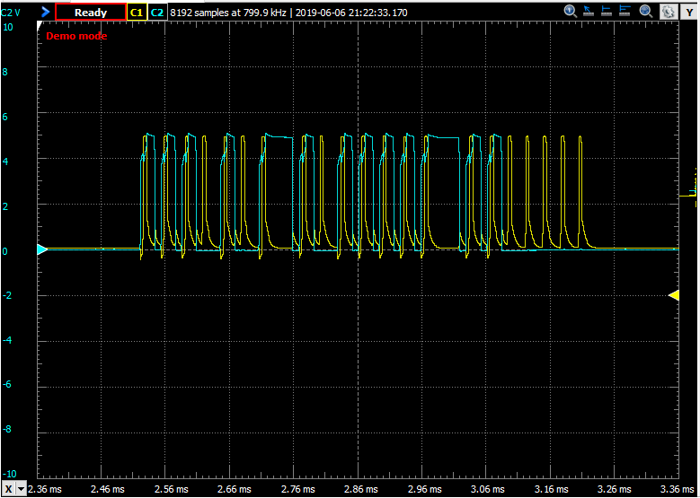
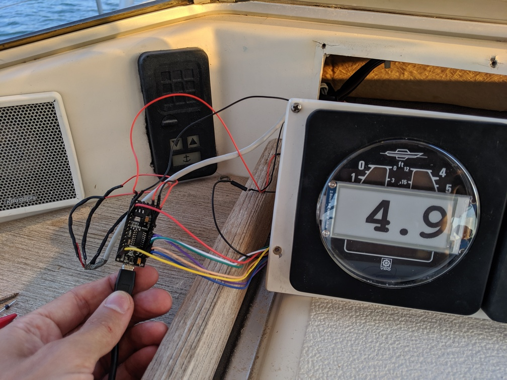
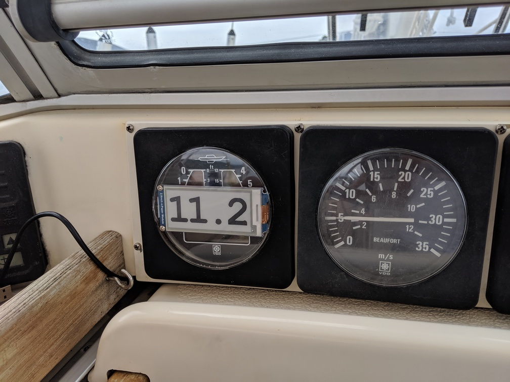

# arduino-depth-meter
New screen to VDO depth meter using [Arduino Nano](https://store.arduino.cc/arduino-nano) and [Waveshare 2.9inch E-Ink display module](https://www.waveshare.com/2.9inch-e-paper-module.htm)
- Datasheets and other information available for the screen from [Waveshare 2.9inch E-Ink display module wiki](https://www.waveshare.com/wiki/2.9inch_e-Paper_Module)
- Code includes support for the Arduino starter kit [16x2 LiquidCrystal display](https://www.arduino.cc/en/Reference/LiquidCrystal)
- Custom font (Courier New 112pt) created using [The Dot Factory](http://www.eran.io/the-dot-factory-an-lcd-font-and-image-generator/)
- Please check the [Three Digit E-paper Instrument Display project](https://hackaday.io/project/159031-three-digit-e-paper-instrument-display) for additional information. It is using the same display
-  Signal from depth meter, captured using Digilent Analog Discovery 2 
- Final project outcome

